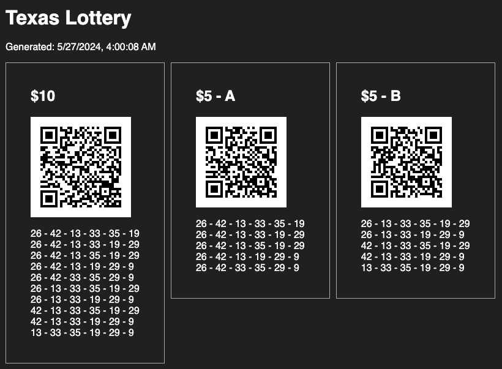

# Texas Lotto QR Code Generator

The Texas lottery has an app that let's you pick a lotto game and numbers that can be played at a lotto vending machine at a grocery or convenient store. After you pick your game, numbers, then options like "cash" or "annual" payment, etc. the app shows you a QR code to then show the vending machine. I picked the game "Texas Lottery", No "Extra!", and "cash" payment options with only 2 combos: 1-2-3-4-5-6, and 49-50-51-52-53-54 which gave me this screen:


The value of this QR code is `LOT21:WLD1JCMNS010203040506495051525354`. After changing my options mentioned above, it was pretty easy to determine the following:

```
LOT21:WLD1JCMNS010203040506495051525354
       | | | | ^ Beginning of selected numbers
       | | | N = No "Extra!" option, Y = Yes
       | | C = Cash Option, A = Annual
       | 1 = 1 drawing per ticket
       L = "Lottery" game, M = Mega Millions
```

Taking this into account, I initially wrote a shell script to scrape a website with suggested combinations, then generate my own QR code based on those numbers. However, at the time, the page didn't have any randomness to it, so it meant that if someone else used suggestions from that page, I would be sharing my winnings with them.

So I re-wrote it in Node, and threw it on an ec2 instance that I could hit from my phone when I go to the grocery store. This script generates a page that looks for highest frequency pairs and singles over the last "x" number of drawings. I'm currently using 150 drawings, but if you want to use this as well, please change this number so we're less likely to share winnings!!!

Here's what the final [index.html](build/index.html) looks like in a browser:




## Setup EC2

### Setup httpd

```sh
# Install
sudo yum install httpd
# Start
sudo service httpd start
# Start httpd when server restarts
sudo chkconfig httpd on
# Set permissions
cd /var/www/html/
sudo chgrp ec2-user .
sudo chmod 775 .
```

### Setup git

```sh
cd ~
sudo yum install git
git clone https://github.com/mrbbdx/lotto-qr-generator
```


## Node Version

This pulls all past drawings (since 1992!) for the TX lotto game from the official website, then generates QR codes for best combinations.

### Setup Node

Google install nvm. Today it's:

```sh
curl -o- https://raw.githubusercontent.com/nvm-sh/nvm/v0.39.7/install.sh | bash
source ~/.bashrc
nvm install --lts

cd ~/lotto-qr-generator
npm install
```

### Symlink Apache to Build Directory

For whatever reason, _parent_ directories of symlinks are also required to have the execute privilege, so add it first.

```sh
chmod 711 ~
cd /var/www/html/
ln -s ~/lotto-qr-generator/build lotto
```

### Add systemd timer to re-generate page every night

```sh
sudo vi /etc/systemd/system/lotto.service
```

```
[Unit]
Description="Generate Lotto Page"

[Service]
ExecStart=cd /home/ec2-user/lotto-qr-generator/ && node src/index.js
```

```sh
sudo vi /etc/systemd/system/lotto.timer
```

```
[Unit]
Description="Run script every night"

[Timer]
OnBootSec=5min
OnUnitActiveSec=24h
OnCalendar=Mon..Fri *-*-* 10:00:*
Unit=lotto.service

[Install]
WantedBy=multi-user.target
```

```sh
sudo systemctl start lotto.timer
sudo systemctl enable lotto.timer
```


## Old shell version

This shell script scrapes some "suggested" lotto numbers from http://www.txlotteryx.com/Lotto/intelligent-combos.htm, and generates QR codes that can be scanned by a lotto machine at the grocery store.


### Install libraries

```sh
sudo yum install qrencode
sudo yum install lynx
```

### Setup script

```sh
chmod 755 lotto.sh
crontab -e
```

then add cron job

```sh
# Generate QR code every night. 11:15 UTC = 5/6:15 AM Central
15 11 * * * /home/ec2-user/lotto.sh
```

